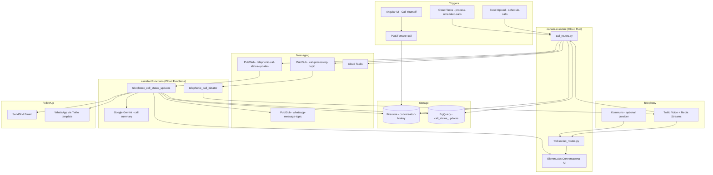

# Paras Project Analysis

## Executive Summary

The **Paras** workspace is a study-abroad lead-generation and student engagement platform built for **Canam Consultants**. It automates outbound phone calls using AI voice agents, collects student preferences, qualifies leads, and triggers follow-up actions (email, WhatsApp, analytics).

The system is split across two main codebases:

| Component | Path | Role |
|-----------|------|------|
| **canam-assistant** | `canam-assistant/` | Real-time voice call server (FastAPI on Cloud Run) |
| **assistantFunctions** | `assistantFunctions-main/` | Async orchestration and post-call processing (GCP Cloud Functions) |

Upstream Git repositories are referenced in `repo-ref.txt`:
- https://github.com/philajay/canam-assistant
- https://github.com/philajay/assistantFunctions

---

## Business Domain & Purpose

### What problem does it solve?

Canam Consultants needs to reach prospective students at scale, gather structured information about their study-abroad interests, and route qualified leads to human counselors. Manual cold calling is slow and inconsistent; this system automates:

1. **Outbound calling** to student phone numbers
2. **Conversational data collection** (country, degree level, timeline, location, callback time)
3. **Lead scoring** (Potential Customer / May be Potential Customer / Not a Potential Customer)
4. **Automated follow-up** via email and WhatsApp
5. **Operational reporting** via BigQuery

### Target user personas (AI agents)

The project defines multiple AI assistant personas through prompt files:

| Persona | File | Purpose |
|---------|------|---------|
| **Monica** | `canam-ai-virtualagent-prompt[paras].txt`, `caliingprompt.txt` | Cold-call virtual assistant for Canam Consultants; collects 6 data slots and ends call with "Goodbye" |
| **Trinity** | `prompts/system_prompt.txt` | Higher-education course consultant (succinct, informative) |
| **Course shortlisting agent** | `gemini-live/live.py` | Gemini Live prototype for interactive course filtering by country, degree, jobs, budget, GPA, IELTS |

The primary production flow centers on **Monica** — a structured, state-machine-driven voice agent for consultation scheduling.

---

## High-Level Architecture



---

## Component Deep Dive

### 1. canam-assistant (Voice Call Server)

**Stack:** Python 3.9, FastAPI, Uvicorn, ElevenLabs SDK, Twilio, Google Cloud SDKs  
**Deployment:** Docker → Google Cloud Run (`gcloud run deploy canam-assistant`)

#### Entry point

`main.py` creates a FastAPI app with CORS enabled and mounts two routers:
- `handleAudioCalls/call_routes.py` — HTTP endpoints for call lifecycle
- `handleAudioCalls/websocket_routes.py` — WebSocket media stream handler (prefixed `/ws`)

#### Key HTTP endpoints

| Endpoint | Method | Description |
|----------|--------|-------------|
| `/make-call` | POST | Schedule a single outbound call by phone number |
| `/schedule-calls` | POST | Upload Excel (`.xlsx`) to bulk-schedule calls |
| `/process-scheduled-calls` | POST | Pick up scheduled records from Firestore and publish to Pub/Sub |
| `/create-scheduled-task` | POST | Create a Cloud Task to trigger batch processing |
| `/outgoing-call/{phone}/{internal_id}` | GET/POST | Twilio webhook — returns TwiML to connect media stream |
| `/call/status/{phone}/{internal_id}` | POST | Twilio status callback (initiated, ringing, answered, busy, etc.) |
| `/call/status/completed/{phone}/{internal_id}/{call_sid}` | POST | Delayed completion handler (triggers post-call pipeline) |
| `/twilio/inbound_call` | POST | Handle inbound calls (connect to AI agent) |

#### WebSocket media stream

`websocket_routes.py` at `/ws/media-stream/{to_phone_number}/{internal_id}`:

1. Accepts audio stream from telephony provider
2. Bridges audio to **ElevenLabs Conversational AI** using `ELEVEN_LABS_COLD_CALLING_AGENT_ID`
3. Injects `executive_summary` from prior calls as a dynamic variable for context continuity
4. On session end: logs `conversation_id` to Firestore, publishes `completed` status to Pub/Sub

#### Audio provider abstraction

Configured via `AUDIO_PROVIDER` env var (default: `kommuno`):

| Provider | Interface class | Notes |
|----------|-----------------|-------|
| `twilio` | `TwilioAudioInterface` | Standard Twilio Media Streams (base64 μ-law audio) |
| `kommuno` | `KommunoAudioInterface` | Indian telephony provider; PCM audio over WebSocket |

#### Call scheduling & retry logic (`common/functions.py`)

- **Scheduling:** Records written to Firestore `conversation-history` with `process_status: scheduled`
- **Batch processing:** Up to `MAX_PARRALLEL_REQUESTS_TO_AGENT` (default 20) calls per batch
- **Retry:** Failed/busy/no-answer calls retried up to `MAX_CALL_RETRY_COUNT` (default 2)
  - If after 7 PM IST → retry next day at 10 AM
  - Otherwise → retry after 2 hours
- **Completion delay:** `STATUS_COMPLETE_TASK_DELAY_IN_SECONDS` (default 300s) before post-call processing, allowing ElevenLabs to finalize conversation audio

#### Configuration (`common/config.py`)

Key environment variables:

```
ELEVENLABS_API_KEY, ELEVEN_LABS_COLD_CALLING_AGENT_ID
TWILIO_ACCOUNT_SID, TWILIO_AUTH_TOKEN, TWILIO_PHONE_NUMBER
PROJECT_ID, QUEUE_NAME, REGION_NAME
BIG_QUERY_DATASET_ID
AUDIO_PROVIDER, KOMMUNO_* (if using Kommuno)
```

---

### 2. assistantFunctions (Post-Call & Orchestration)

**Stack:** Python, `functions_framework`, Google Cloud Functions (event-driven)  
**Deployment:** `gcloud run deploy telephonic-call-status-updates-processor`

#### Cloud Functions

| Function | Trigger | Responsibility |
|----------|---------|----------------|
| `telephonic_call_initiator` | Pub/Sub `call-processing-topic` | Initiates Twilio outbound call |
| `telephonic_call_status_updates` | Pub/Sub `telephonic-call-status-updates` | Processes call completion |

#### Call initiation flow (`process_initiated_call`)

1. Receives `{doc_id, name, phonenumber, filename, internal_id}` from Pub/Sub
2. Creates Twilio call pointing to `WEB_SERVER_URL/outgoing-call/{phone}/{internal_id}`
3. Registers status callback URL
4. Logs `initiated` status to Firestore

#### Post-call processing (`take_status_completed_action`)

When a call status is `completed`:

1. Fetches `conversation_id` from Firestore
2. Downloads conversation audio from ElevenLabs API
3. Sends audio to **Google Gemini** with `call_summary_agent_to_user_prompt` (`prompts.py`)
4. Parses JSON response with fields:
   - `summary` — student-facing recap (sent via WhatsApp)
   - `executive_summary` — manager-facing summary (sent via email)
   - `conversation_flag` — lead qualification category
   - `dangerous_content` — safety flag
5. Writes results to BigQuery and Firestore
6. If lead is **Potential Customer** or **May be Potential Customer**:
   - Sends email to `AGENT_EMAIL_ID`
   - Sends WhatsApp template message (unless content flagged dangerous)

#### Lead qualification categories

Defined in `assistantFunctions-main/prompts.py`:

- **Potential Customer** — clear interest in courses, country, visa, or budget
- **May be Potential Customer** — vague or indirect interest
- **Not a Potential Customer** — no interest or abrupt hang-up
- **Random Conversation** — irrelevant questions only

---

### 3. Angular UI (`canam-assistant/UI/canam-assistant`)

**Stack:** Angular 20, ElevenLabs client SDK, Webpack bundling (Angular Elements)

Embeddable widgets for testing and demo:

| Component | Purpose |
|-----------|---------|
| `CallYourself` | Form to enter phone number + name; POSTs to Cloud Run `/make-call` |
| `VoiceChat` | Browser-based direct voice chat with ElevenLabs agent (no telephony) |

The UI is built as standalone Angular Elements (`build:prod` → webpack bundle) for embedding in external websites.

**Production endpoint hardcoded:** `https://canam-assistant-153475391202.us-central1.run.app/make-call`

---

### 4. Gemini Live Prototype (`gemini-live/live.py`)

Experimental WebSocket server (port 9083) using **Gemini 2.0 Flash Live** for real-time voice course shortlisting.

Features:
- Structured conversation flow (country → degree → jobs → budget → marks → IELTS)
- Function calling: `showFilter`, `applyFilter`
- Germany-specific rule: CGPA < 75% → foundation course (degree 16)

This appears to be a **separate prototype** and is not integrated into the main call pipeline.

---

## Data Model

### Firestore: `conversation-history/{phone_number}`

```
{
  name, to_phone_number, process_status, filename,
  scheduled_at, last_internal_id, retry_count,
  executive_summary  // accumulated across calls
}
```

### Firestore subcollection: `conversation-history/{phone}/calls/{internal_id}`

```
{
  call_sid, from_phone_number, status, conversation_id,
  internal_id, timestamp, status_update_timestamp, retry_count,
  conversation_summary, executive_summary, conversation_flag, dangerous_content
}
```

### BigQuery: `{PROJECT_ID}.{BIG_QUERY_DATASET_ID}.call_status_updates`

Columns: `internal_id`, `call_sid`, `to_phone_number`, `status`, `insert_timestamp`, `conversation_flag`, `dangerous_content`, `executive_summary`

Sample reporting queries are in `assistantFunctions-main/reports/queries.sql` (daily call volumes, lead flag breakdowns).

---

## End-to-End Call Flow

```
1. SCHEDULE
   Excel upload or /make-call → Firestore (process_status: scheduled)

2. BATCH INITIATE
   Cloud Task → /process-scheduled-calls
   → Pub/Sub (call-processing-topic)
   → telephonic_call_initiator Cloud Function
   → Twilio creates outbound call

3. CONNECT
   Twilio hits /outgoing-call → TwiML with WebSocket URL
   → /ws/media-stream bridges audio to ElevenLabs agent (Monica)
   → Agent collects 6 data slots, says "Goodbye" to hang up

4. STATUS TRACKING
   Twilio callbacks → /call/status/{phone}/{internal_id}
   → BigQuery + Firestore updated
   → Failed calls scheduled for retry via Cloud Tasks

5. COMPLETION
   On "completed" → delayed Cloud Task (5 min)
   → Pub/Sub (telephonic-call-status-updates)
   → telephonic_call_status_updates Cloud Function
   → Gemini summarizes audio → lead flag → email/WhatsApp
```

---

## External Service Dependencies

| Service | Usage |
|---------|-------|
| **Twilio** | Outbound/inbound voice, status callbacks, WhatsApp templates |
| **ElevenLabs** | Conversational AI voice agents, conversation audio retrieval |
| **Google Gemini** | Post-call audio summarization and lead classification |
| **Kommuno** | Alternative Indian telephony provider (optional) |
| **Google Cloud Firestore** | Call and conversation state |
| **Google Cloud Pub/Sub** | Async event bus between services |
| **Google Cloud Tasks** | Delayed retries and batch scheduling |
| **Google BigQuery** | Analytics and reporting |
| **SendGrid** | Email notifications to agents |
| **ngrok** | Local development tunneling (referenced in config) |

---

## Project Scope

### In scope (implemented)

- Outbound AI voice calling at scale (batch + single)
- Multi-provider telephony (Twilio + Kommuno)
- Structured conversational data collection via ElevenLabs agents
- Call retry with time-of-day awareness (IST)
- Post-call AI summarization and lead scoring
- Automated agent email alerts and student WhatsApp follow-up
- Conversation history and executive summary continuity across calls
- BigQuery analytics
- Embeddable Angular UI widgets
- Dockerized Cloud Run deployment

### Adjacent / prototype (not fully integrated)

- **Gemini Live** course shortlisting (`gemini-live/live.py`)
- **Trinity** course consultant prompt (`prompts/system_prompt.txt`)
- **Inbound call** handler (`/twilio/inbound_call`) — basic wiring exists
- **After-visit feedback agent** — config key `ELEVEN_LABS_AFTER_VISIT_FEEDBACK_AGENT_ID` exists but no dedicated route found

### Out of scope / not present

- User authentication or admin dashboard
- CRM integration (beyond Firestore/BigQuery)
- Automated test suite (only Angular spec stubs)
- Infrastructure-as-code (Terraform/Pulumi)
- CI/CD pipeline definitions

---

## File & Directory Map

```
Paras/
├── analysis.md                          # This document
├── repo-ref.txt                         # Upstream GitHub URLs
├── canam-ai-virtualagent-prompt[paras].txt  # Monica agent prompt (production)
├── canam-assistant/
│   ├── main.py                          # FastAPI entry point
│   ├── Dockerfile                       # Cloud Run container
│   ├── requirements.txt
│   ├── instructions.txt                 # Deploy command
│   ├── caliingprompt.txt                # Earlier Monica prompt draft
│   ├── common/
│   │   ├── config.py                    # Environment configuration
│   │   └── functions.py                 # Scheduling, retry, BigQuery, Pub/Sub
│   ├── handleAudioCalls/
│   │   ├── call_routes.py               # HTTP call endpoints
│   │   ├── websocket_routes.py        # ElevenLabs media bridge
│   │   ├── twilio_audio_interface.py
│   │   └── kommuno_audio_interface.py
│   ├── gemini-live/
│   │   └── live.py                      # Gemini Live prototype
│   ├── prompts/
│   │   └── system_prompt.txt            # Trinity agent prompt
│   └── UI/canam-assistant/              # Angular embeddable widgets
├── assistantFunctions-main/
│   ├── main.py                          # Cloud Functions entry
│   ├── prompts.py                       # Call summary Gemini prompt
│   ├── common/config.py
│   ├── instructions.txt                 # Deploy command
│   └── reports/queries.sql              # BigQuery analytics
```

---

## Notable Implementation Details

1. **"Goodbye" hang-up trigger:** The Monica prompt requires the agent to say the exact word "Goodbye" so the telecom system can disconnect the call.

2. **Executive summary continuity:** Prior call summaries are passed to ElevenLabs as `dynamic_variables.executive_summary`, giving the agent context on repeat contacts.

3. **Delayed post-call processing:** A 5-minute Cloud Task delay ensures ElevenLabs has finalized conversation audio before summarization.

4. **Parallelism cap:** `MAX_PARRALLEL_REQUESTS_TO_AGENT` limits concurrent outbound calls to avoid overwhelming the AI agent or telephony provider.

5. **main.py bug:** The `if __name__ == "__main__"` block calls `app.run()` which is not a FastAPI method; the Dockerfile correctly uses `uvicorn main:app` instead.

---

## Summary

**Paras** is a production-oriented **AI voice outbound calling platform** for Canam Consultants' study-abroad lead generation. It combines ElevenLabs conversational AI, Twilio/Kommuno telephony, and Google Cloud serverless infrastructure to automate student outreach, qualify leads, and trigger human follow-up — with analytics stored in BigQuery for operational reporting.

The workspace also contains prompt engineering artifacts and a Gemini Live prototype for a different use case (interactive course shortlisting), suggesting the broader product vision extends beyond cold calling into full student counseling automation.
